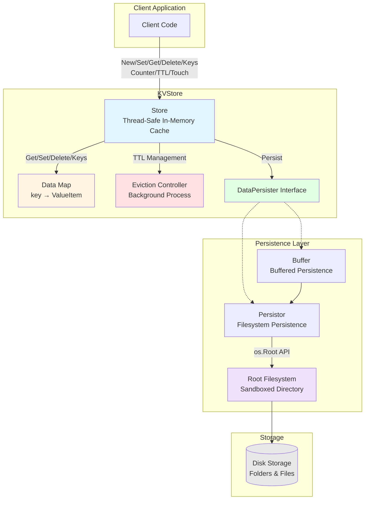

# Go-KVStore: Key-Value Store in Go

[](https://goreportcard.com/report/github.com/jrsteele09/go-kvstore)
[](https://pkg.go.dev/github.com/jrsteele09/go-kvstore)

## Overview

Go-KVStore is a fast, lightweight key-value store written in Go. It provides in-memory caching with optional persistence to disk. It's designed to be simple to integrate and extremely easy to use. Perfect for projects that need a local key-value store or a caching layer.

### Features

- **In-memory Caching**: Fast data retrieval.
- **Optional Persistence**: Can persist data to disk.
- **Thread-Safe**: Built for concurrent usage.
- **Pluggable Backends**: Extensible for different storage backends.
- **Counters**: Supports atomic counter operations with optional limits.

## Installation

To install Go-KVStore, run the following command:

```bash
go get -u github.com/jrsteele09/go-kvstore
```

## Basic Quick Start (Without Data Persistence)

To use `go-kvstore` without persistence, simply initialize a new store and begin using its methods. Always remember to call `Close()` when you're done to clean up resources.

```go
package main

import (
	"fmt"
	"github.com/jrsteele09/go-kvstore/kvstore"
)

func main() {
	// Initialize kvstore without persistence
	kv, err := kvstore.New()
	if err != nil {
		fmt.Println("Error:", err)
		return
	}
	defer kv.Close() // Always close to clean up resources

	// Set a value
	if err := kv.Set("name", []byte("John")); err != nil {
		fmt.Println("Error:", err)
		return
	}

	// Get the value
	value, err := kv.Get("name")
	if err != nil {
		fmt.Println("Error:", err)
		return
	}
	fmt.Println("Name:", string(value))

	// Delete the value
	if err := kv.Delete("name"); err != nil {
		fmt.Println("Error:", err)
	}

	// List all keys (should be empty after deletion)
	keys := kv.Keys()
	fmt.Println("Keys:", keys)
}
```

## With Data Persistence

For applications requiring data persistence, `go-kvstore` can be configured with one or multiple `DataPersister` instances. Importantly, the store will use only the first `DataPersister` instance to reload any previously persisted data back into the cache upon initialization. This feature ensures that the application's state remains consistent even after restarts or shutdowns.

**Important:** Always call `kv.Close()` when you're done - it automatically closes all persistence layers (buffers and underlying persisters) and stops background goroutines. You don't need to manually close the persistence layers.

### Example: Initializing with Filesystem-Based Data Persister

Here, the `go-kvstore` is initialized using a buffered, filesystem-based `DataPersister`.

```go
package main

import (
	"fmt"
	"github.com/jrsteele09/go-kvstore/kvstore"
	"github.com/jrsteele09/go-kvstore/persistence"
)

func main() {
	// Create a Filesystem DataPersister instance
	fsPersistence, err := persistence.New("testFolder")
	if err != nil {
		fmt.Println("Error:", err)
		return
	}

	// Create a buffered DataPersister
	bufferedPersistence, err := persistence.NewBuffer(fsPersistence, 10)
	if err != nil {
		fmt.Println("Error:", err)
		return
	}

	// Initialize kvstore with the buffered DataPersister
	kv, err := kvstore.New(kvstore.WithPersistenceOption(bufferedPersistence))
	if err != nil {
		fmt.Println("Error:", err)
		return
	}
	defer kv.Close() // Automatically closes the store, buffer, and fsPersistence

	// Now, kv will use fsPersistence wrapped in bufferedPersistence for data persistence
	// Any previously persisted data will be reloaded into the cache

	// Set a value
	if err := kv.Set("name", []byte("John")); err != nil {
		fmt.Println("Error:", err)
		return
	}

	// Get the value
	value, err := kv.Get("name")
	if err != nil {
		fmt.Println("Error:", err)
		return
	}
	fmt.Println("Name:", string(value))
}
```

### Basic Operations

#### Set a Value

```go
err := kv.Set("key", []byte("value"))
if err != nil {
    // Handle error
}
```

#### Get a Value

```go
value, err := kv.Get("key") // Returns []byte
if err != nil {
    // Handle error
}
fmt.Println(string(value)) // Convert to string if needed
```

#### Delete a Value

```go
err := kv.Delete("key")
if err != nil {
    // Handle error
}
```

#### List All Keys

```go
keys := kv.Keys() // Returns []string
```

#### Hierarchical Keys

Keys can contain `/` to represent hierarchical folder structures in persistence:

```go
// Store with hierarchical keys
err := kv.Set("tenant/user1", []byte("user data"))
err = kv.Set("tenant/clients/1", []byte("client data"))
err = kv.Set("tenant/clients/2", []byte("client data"))

// These will be persisted as:
// tenant/user1.meta and tenant/user1.data
// tenant/clients/1.meta and tenant/clients/1.data
// tenant/clients/2.meta and tenant/clients/2.data

// Keys with special characters like ':' are automatically sanitized for filesystem compatibility
err := kv.Set("user:123", []byte("data"))
```

### Advanced Operations

#### Query Keys

```go
import "time"

// Query keys created between two timestamps
from := time.Now().Add(-24 * time.Hour)
to := time.Now()
keys, err := kv.QueryKeys(from, to)
if err != nil {
    // Handle error
}
```

#### Set Time-to-Live (TTL)

```go
err := kv.SetTTL("key", 60)  // 60 seconds
if err != nil {
    // Handle error
}
```

#### Touch a Key to Reset its TTL

```go
err := kv.Touch("key")
if err != nil {
    // Handle error
}
```

#### Counters

Counters are atomic integer operations with optional min/max limits. There are two ways to create a counter:

**Method 1: Using Counter() directly**
```go
// Create a counter initialized to 5 (with default limits: math.MinInt64 to math.MaxInt64)
count, err := kv.Counter("pageviews", 5)
if err != nil {
    // Handle error
}
fmt.Println("Counter value:", count) // 5

// Increment by 10
count, err = kv.Counter("pageviews", 10)
fmt.Println("Counter value:", count) // 15

// Decrement by 3
count, err = kv.Counter("pageviews", -3)
fmt.Println("Counter value:", count) // 12
```

**Method 2: Using SetCounterLimits() with bounded values**
```go
// Create a counter with custom limits (Min: 0, Max: 100), initialized to 0
err := kv.SetCounterLimits("score", 0, 100)
if err != nil {
    // Handle error
}

// Increment the counter
score, err := kv.Counter("score", 15)
if err != nil {
    // Handle error
}
fmt.Println("Current score:", score) // 15

// Trying to exceed max returns an error
score, err = kv.Counter("score", 90) // Would result in 105
if err != nil {
    fmt.Println("Error:", err) // "Store.Counter maximum value reached"
}
```

**Important:** Once a key is used as a counter, it can only be used for counter operations. Calling `Set()` on a counter key will overwrite it as regular data.

## Documentation

### Architecture Overview



### Component Descriptions

- **Store**: Thread-safe in-memory key-value store with optional persistence
- **ValueItem**: Holds data, timestamp, TTL, and optional counter constraints
- **DataPersister**: Interface for pluggable persistence backends
- **Buffer**: Asynchronous buffered writes for better performance
- **Persistor**: Filesystem-based persistence using `os.Root` for security
- **Eviction Controller**: Background process that removes expired keys and unloads old data

For full documentation, please refer to the [GoDoc documentation](https://pkg.go.dev/github.com/jrsteele09/go-kvstore).

## Contributing

We welcome contributions! Please see [CONTRIBUTING.md](CONTRIBUTING.md) for details on how to contribute.

## License

This project is licensed under the MIT License - see the [LICENSE.md](LICENSE.md) file for details.
