# Go-KVStore: Key-Value Store in Go

[](https://goreportcard.com/report/github.com/jrsteele09/go-kvstore)
[](https://pkg.go.dev/github.com/jrsteele09/go-kvstore)

## Overview

Go-KVStore is a fast, lightweight key-value store written in Go. It provides in-memory caching with optional persistence to disk. It's designed to be simple to integrate and extremely easy to use. Perfect for projects that need a local key-value store or a caching layer.

### Features

- **In-memory Caching**: Fast data retrieval.
- **Optional Persistence**: Can persist data to disk.
- **Thread-Safe**: Built for concurrent usage.
- **Pluggable Backends**: Extensible for different storage backends.
- **Counters**: Supports atomic counter operations with optional limits.

## Installation

To install Go-KVStore, run the following command:

```bash
go get -u github.com/jrsteele09/go-kvstore
```

## Basic Quick Start (Without Data Persistence)

To use `go-kvstore` without persistence, simply initialize a new store and begin using its methods.

```go
package main

import (
	"fmt"
	"github.com/jrsteele09/go-kvstore/kvstore"
)

func main() {
	// Initialize kvstore without persistence
	kv, _ := kvstore.New()

	// Set a value
	kv.Set("name", []byte("John"))

	// Get the value
	value, _ := kv.Get("name")
	fmt.Println("Name:", value)

	// Delete the value
	kv.Delete("name")

	// List all keys (should be empty after deletion)
	keys, _ := kv.Keys()
	fmt.Println("Keys:", keys)

    // Close the kvstore
	kv.Close()
}
```

## With Data Persistence

For applications requiring data persistence, `go-kvstore` can be configured with one or multiple `DataPersister` instances. Importantly, the store will use only the first `DataPersister` instance to reload any previously persisted data back into the cache upon initialization. This feature ensures that the application's state remains consistent even after restarts or shutdowns.

### Example: Initializing with Filesystem-Based Data Persister

Here, the `go-kvstore` is initialized using a buffered, filesystem-based `DataPersister`.

```go
package main

import (
	"fmt"
	"github.com/jrsteele09/go-kvstore/kvstore"
	"github.com/jrsteele09/go-kvstore/persistence"
)

func main() {
	// Create a Filesystem DataPersister instance
	fsPersistence := persistence.New("testFolder")

	// Create a buffered DataPersister
	bufferedPersistence := persistence.NewBuffer(fsPersistence, 10)

	// Initialize kvstore with the buffered DataPersister
	kv, _ := kvstore.New(kvstore.WithPersistenceOption(bufferedPersistence))

	// Now, kv will use fsPersistence wrapped in bufferedPersistence for data persistence
	// Any previously persisted data will be reloaded into the cache

	// Set a value
	kv.Set("name", []byte("John"))

	// Get the value
	value, _ := kv.Get("name")
	fmt.Println("Name:", string(value))

    // Close the kvstore
	kv.Close()
}
```

### Basic Operations

#### Set a Value

```go
err := kv.Set("key", []byte("value"))
if err != nil {
    // Handle error
}
```

#### Get a Value

```go
value, err := kv.Get("key") // Returns []byte
if err != nil {
    // Handle error
}
fmt.Println(string(value)) // Convert to string if needed
```

#### Delete a Value

```go
err := kv.Delete("key")
if err != nil {
    // Handle error
}
```

#### List All Keys

```go
keys, err := kv.Keys()
if err != nil {
    // Handle error
}
```

### Advanced Operations

#### Query Keys

```go
import "time"

// Query keys created between two timestamps
from := time.Now().Add(-24 * time.Hour)
to := time.Now()
keys, err := kv.QueryKeys(from, to)
if err != nil {
    // Handle error
}
```

#### Set Time-to-Live (TTL)

```go
err := kv.SetTTL("key", 60)  // 60 seconds
if err != nil {
    // Handle error
}
```

#### Touch a Key to Reset its TTL

```go
err := kv.Touch("key")
if err != nil {
    // Handle error
}
```

#### Set Counter Limits and Use Counter

```go
// Set the limits for the counter (Min: 0, Max: 100)
err := kv.SetCounterLimits("counter_key", 0, 100)
if err != nil {
    // Handle error
}

// Increment the counter by 1
counterValue, err := kv.Counter("counter_key", 1)
if err != nil {
    // Handle error
}

// Output the current counter value
fmt.Println("Current counter value:", counterValue)
```

## Documentation

### Architecture Overview

```mermaid
graph TB
    subgraph "Client Application"
        Client[Client Code]
    end
    
    subgraph "KVStore"
        Store[Store<br/>Thread-Safe In-Memory Cache]
        Store --> |Get/Set/Delete/Keys| Data[Data Map<br/>key → ValueItem]
        Store --> |TTL Management| Eviction[Eviction Controller<br/>Background Process]
        Store --> |Persist| Persist[DataPersister Interface]
    end
    
    subgraph "Persistence Layer"
        Persist -.-> Buffer[Buffer<br/>Buffered Persistence]
        Persist -.-> FileSystem[Persistor<br/>Filesystem Persistence]
        Buffer --> FileSystem
        FileSystem --> |os.Root API| RootFS[Root Filesystem<br/>Sandboxed Directory]
    end
    
    subgraph "Storage"
        RootFS --> Disk[(Disk Storage<br/>Folders & Files)]
    end
    
    Client --> |New/Set/Get/Delete/Keys<br/>Counter/TTL/Touch| Store
    
    style Store fill:#e1f5ff
    style Data fill:#fff4e1
    style Eviction fill:#ffe1e1
    style Persist fill:#e1ffe1
    style RootFS fill:#f0e1ff
    style Disk fill:#e8e8e8
```



### Component Descriptions

- **Store**: Thread-safe in-memory key-value store with optional persistence
- **ValueItem**: Holds data, timestamp, TTL, and optional counter constraints
- **DataPersister**: Interface for pluggable persistence backends
- **Buffer**: Asynchronous buffered writes for better performance
- **Persistor**: Filesystem-based persistence using `os.Root` for security
- **Eviction Controller**: Background process that removes expired keys and unloads old data

For full documentation, please refer to the [GoDoc documentation](https://pkg.go.dev/github.com/jrsteele09/go-kvstore).

## Contributing

We welcome contributions! Please see [CONTRIBUTING.md](CONTRIBUTING.md) for details on how to contribute.

## License

This project is licensed under the MIT License - see the [LICENSE.md](LICENSE.md) file for details.
